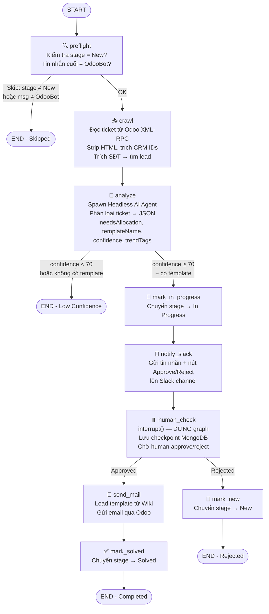
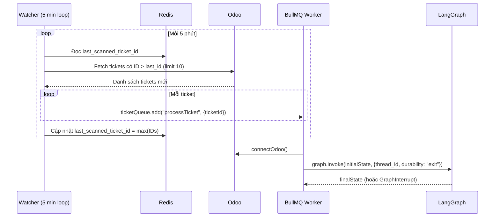
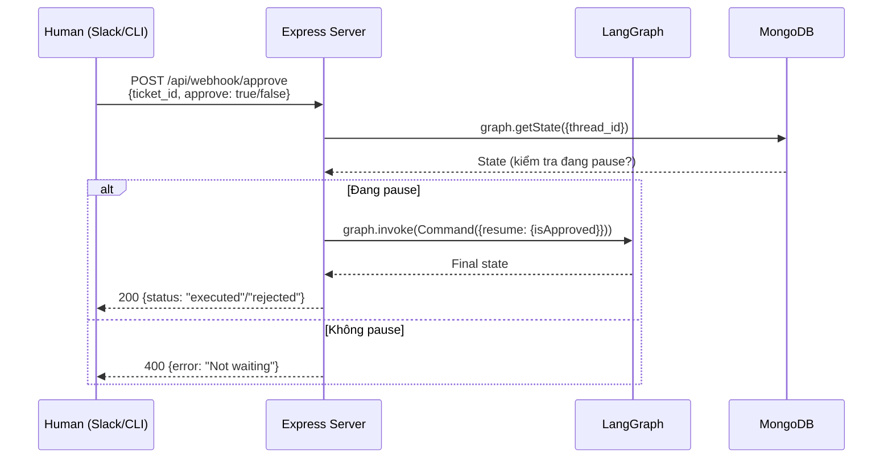
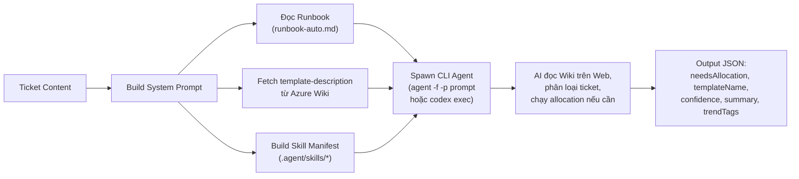
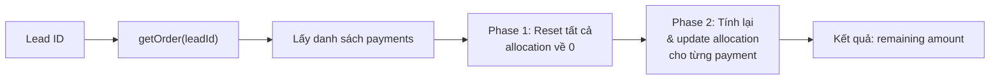
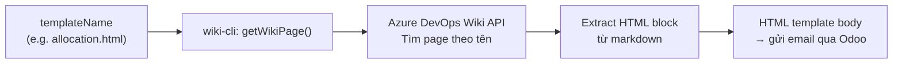
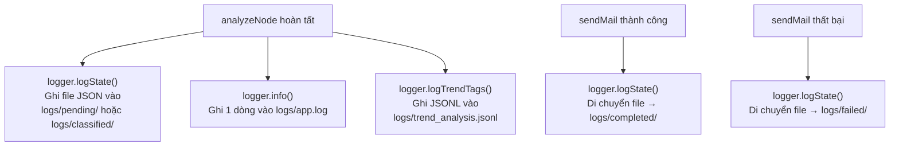
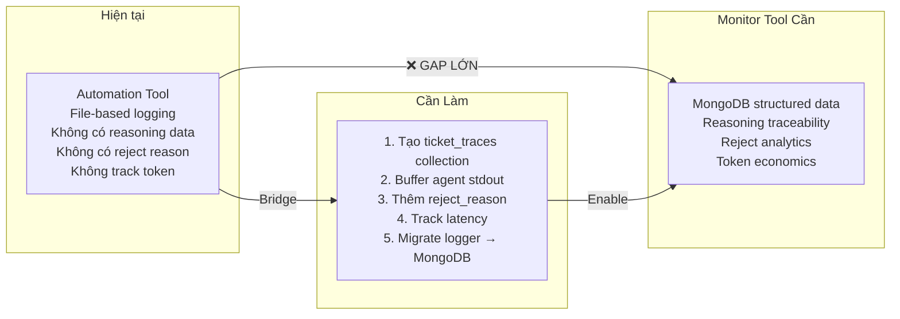

# Review Dự Án & Đánh Giá Monitor Tool

---

## Phần 1: Tổng quan kiến trúc dự án

Dự án là một **monorepo pnpm** gồm 4 package:

| Package | Vai trò |
|---|---|
| `api-server` | **Trung tâm điều phối** — Express server + LangGraph workflow + Redis queue + MongoDB checkpoint |
| `odoo-auto-cli` | **Cầu nối Odoo** — XML-RPC helpers (crawl ticket, reply email, resolve ticket) |
| `allocation-cli` | **Phân bổ thanh toán CRM** — reset & update payment allocation cho từng lead |
| `wiki-cli` | **Truy vấn Wiki** — đọc/ghi Azure DevOps Wiki (template email, mô tả template) |

```mermaid
graph TB
    subgraph "External Systems"
        Odoo["Odoo Helpdesk"]
        CRM["MindX CRM API"]
        Wiki["Azure DevOps Wiki"]
        Slack["Slack"]
        AI["Headless AI Agent<br/>(Cursor/Codex CLI)"]
    end

    subgraph "api-server"
        Watcher["Watcher<br/>(Polling 5 phút)"]
        Queue["Redis/BullMQ<br/>Queue"]
        Graph["LangGraph<br/>(9 nodes)"]
        Checkpoint["MongoDB<br/>Checkpointer"]
        Routes["Express Routes<br/>/approve, /slack"]
    end

    subgraph "CLI Packages"
        OdooCLI["odoo-auto-cli"]
        AlloCLI["allocation-cli"]
        WikiCLI["wiki-cli"]
    end

    Odoo -->|XML-RPC| Watcher
    Watcher -->|enqueue| Queue
    Queue -->|invoke| Graph
    Graph -->|persist state| Checkpoint
    Graph -->|spawn| AI
    AI -->|read skills/wiki| WikiCLI
    Graph -->|send email| OdooCLI
    OdooCLI -->|load template| WikiCLI
    Graph -->|notify| Slack
    Slack -->|approve/reject| Routes
    Routes -->|resume| Graph
    Graph -.->|allocation (via AI)| AlloCLI
```

---

## Phần 2: Tất cả Workflows của dự án

### Workflow 1: Main Ticket Processing (LangGraph)

Đây là workflow **cốt lõi nhất** — xử lý tự động mỗi ticket Odoo Helpdesk.



**Giải thích từng bước:**

1. **Preflight** — Lọc ticket: chỉ xử lý ticket ở stage "New" và tin nhắn cuối từ OdooBot (= ticket mới từ khách, không phải nhân viên trả lời)
2. **Crawl** — Đọc nội dung ticket qua Odoo XML-RPC, strip HTML, trích xuất CRM Lead IDs (từ URL và SĐT)
3. **Analyze** — Spawn một AI Agent chạy headless (Cursor CLI hoặc Codex), agent đọc Wiki + Runbook + Skills để phân loại ticket → output JSON
4. **Mark In Progress** — Nếu AI tự tin ≥ 70% + có template → chuyển ticket sang "In Progress"
5. **Notify Slack** — Gửi thông báo lên Slack với nút Approve/Reject
6. **Human Check** — Graph **dừng** (interrupt), lưu state vào MongoDB, chờ người duyệt
7. **Send Mail** *(nếu approved)* — Load template HTML từ Azure Wiki, gửi email qua Odoo
8. **Mark Solved** *(nếu approved)* — Chuyển ticket sang stage "Solved"
9. **Mark New** *(nếu rejected)* — Chuyển ticket về stage "New"

---

### Workflow 2: Ticket Polling & Queueing



**Giải thích:** Watcher poll Odoo mỗi 5 phút, lấy tối đa 10 ticket mới, đẩy vào Redis queue. BullMQ worker lấy từng job ra xử lý tuần tự (concurrency: 1). Mỗi job gọi `graph.invoke()` — graph chạy đến `human_check` thì interrupt, checkpoint lưu MongoDB.

---

### Workflow 3: Human Approval (Webhook/Slack)



**Giải thích:** Sau khi graph dừng tại `human_check`, người dùng approve/reject qua 2 kênh:
- **Webhook API** — `POST /api/webhook/approve`
- **Slack** — nhấn nút Approve/Reject trên Slack → `POST /api/webhook/slack-interactivity`

Cả 2 đều resume graph bằng `Command({ resume: { isApproved } })`, graph tiếp tục chạy `send_mail + mark_solved` hoặc `mark_new`.

---

### Workflow 4: AI Agent Classification (Analyze)



**Giải thích:** Node `analyze` build một system prompt bao gồm runbook + danh sách template + danh sách skills, rồi spawn một **headless AI agent** (Cursor/Codex CLI). Agent tự đọc Wiki, phân loại ticket, và có thể tự chạy allocation nếu cần (đọc SKILL.md → chạy `pnpm allocation`). Output là JSON có confidence score.

---

### Workflow 5: CRM Payment Allocation



**Giải thích:** Khi ticket liên quan đến lỗi phân bổ thanh toán (enrollment, pay-not-full...), AI agent sẽ tự chạy `pnpm allocation --lead-id <id>`. CLI này reset toàn bộ payment allocation rồi tính lại từ đầu.

---

### Workflow 6: Wiki Template Loading



**Giải thích:** Khi cần gửi email, `sendMail` node gọi `loadTemplate()` → Wiki CLI truy vấn Azure DevOps Wiki API → tìm page theo tên → extract block ```` ```html ``` ```` → trả về HTML body → gửi qua Odoo.

---

### Workflow 7: Logging & Trend Analysis



**Giải thích:** Logger ghi dữ liệu ra **file hệ thống cục bộ** (không phải MongoDB):
- `logs/pending/`, `logs/classified/`, `logs/completed/`, `logs/failed/` — JSON state của từng ticket
- `logs/app.log` — master log 1 dòng per ticket
- `logs/trend_analysis.jsonl` — JSON Lines cho trend tags

---

## Phần 3: Đánh giá Monitor Tool

### 3.1. Monitor Tool có cần thiết không?

> [!IMPORTANT]
> **Có, Monitor Tool CÓ GIÁ TRỊ THỰC SỰ**, nhưng mức độ cần thiết khác nhau cho từng feature.

| Feature | Cần thiết? | Lý do |
|---|---|---|
| **F1: Agent Reasoning Traceability** | ⭐⭐⭐⭐⭐ **Rất cần** | Hiện tại AI agent chạy headless, output chỉ là JSON cuối cùng. **Không có cách nào** xem AI đã đọc Wiki page nào, tìm keyword gì, suy luận ra sao. Human approver chỉ thấy `templateName + confidence` trên Slack, **không có cơ sở** để đánh giá đúng/sai. |
| **F2: Wiki Gap & "New" Analytics** | ⭐⭐⭐⭐ **Cần** | Ticket bị skip (confidence < 70) hoặc reject **hiện chỉ ghi vào file log cục bộ**. Không có dashboard, không phân loại root cause, không gom nhóm. Dữ liệu lỗi đang bị lãng phí. |
| **F3: Token Economics** | ⭐⭐⭐ **Có ích nhưng không urgent** | Hiện tại tool **hoàn toàn không track token hay latency**. Có ích để justify chi phí, nhưng không ảnh hưởng đến chất lượng xử lý ticket. |

### 3.2. Khoảng cách giữa Monitor Tool docs và Automation Tool thực tế

> [!WARNING]
> Docs Monitor Tool mô tả một kiến trúc **lý tưởng** mà automation tool hiện tại **chưa hỗ trợ**. Có nhiều gap cần bridge.

#### Gap 1: Nguồn dữ liệu — File-based vs MongoDB

| Monitor Tool docs mô tả | Automation Tool thực tế |
|---|---|
| "Tool Automation cập nhật trạng thái chi tiết (Technical Logs) lên **MongoDB Atlas**" | Logger chỉ ghi ra **file hệ thống cục bộ** (`logs/` folder). Không đẩy gì lên MongoDB ngoài LangGraph checkpoint |
| "Dữ liệu JSON cần gửi vào MongoDB: `research_logs`, `source_urls`, `reasoning_text`" | **Không tồn tại** các field này trong code. `TicketState` không có field nào liên quan đến reasoning |
| "Dữ liệu JSON cần gửi thêm: `failure_type`, `human_feedback`, `ai_initial_guess`" | **Không tồn tại**. Khi reject, chỉ ghi `isApproved: false`, không có lý do reject |
| "Dữ liệu JSON cần gửi: `input_tokens`, `output_tokens`, `latency_ms`" | **Không tồn tại**. Headless Agent CLI spawn bằng `execFile`, không track token usage |

#### Gap 2: AI Reasoning Data — Không có gì để monitor

Đây là **gap lớn nhất**. Monitor Tool F1 muốn hiển thị "chuỗi suy luận AI" nhưng:

- AI agent chạy headless bằng `execFile("agent", args)` — chỉ capture stdout/stderr
- Output cuối cùng chỉ là JSON: `{needsAllocation, templateName, confidence, summary, trendTags}`
- **Không capture**: AI đã truy cập Wiki page nào, search keyword gì, đọc content gì, reasoning chain ra sao
- `agent-cli.ts` có stream stdout (`child.stdout?.on("data", ...)`) nhưng chỉ in ra console, **không lưu lại**

#### Gap 3: Reject Feedback — Không có feedback loop

- Khi human reject trên Slack/API, chỉ gửi `{isApproved: false}` → graph chạy `markNew` → END
- **Không có field** để human nhập lý do reject
- Monitor Tool F2 muốn "Reject Analytics" với "Lý do Reject" nhưng dữ liệu này **không tồn tại**

#### Gap 4: LangGraph Checkpoint ≠ Custom Monitoring Data

- MongoDB hiện chỉ lưu **LangGraph checkpoint** (internal format của `@langchain/langgraph-checkpoint-mongodb`)
- Format này không dễ query bằng Monitor Tool — nó là serialized graph state, không phải business-level metrics
- Monitor Tool cần một **collection riêng** với schema rõ ràng

---

### 3.3. Các thay đổi cần thiết để Monitor Tool docs khớp với thực tế

> [!IMPORTANT]
> Để Monitor Tool hoạt động, cần thay đổi **CẢ HAI PHÍA**: automation tool cần emit data, và Monitor Tool docs cần điều chỉnh kỳ vọng.

#### A. Thay đổi phía Automation Tool (bắt buộc)

##### 1. Tạo MongoDB collection riêng cho monitoring

Không nên đọc LangGraph checkpoint. Cần tạo collection `ticket_traces` riêng:

```typescript
// Đề xuất schema cho ticket_traces collection
interface TicketTrace {
  ticketId: number;
  ticketName: string;
  timestamp: Date;
  stage: "pending" | "classified" | "completed" | "failed" | "rejected";
  
  // F1: Reasoning data
  agentRawOutput: string;        // full stdout từ AI agent
  agentSummary: string;
  templateName: string;
  confidence: number;
  
  // F2: Failure/Reject data
  failureType?: "low_confidence" | "no_template" | "human_reject" | "error";
  rejectReason?: string;         // input từ human
  
  // F3: Performance data
  agentLatencyMs?: number;
  
  // Existing
  trendTags: string[];
  needsAllocation: boolean;
  crmIds: string[];
}
```

##### 2. Capture AI agent reasoning output

Thay đổi `agent-cli.ts` để **buffer stdout** thay vì chỉ stream ra console:

```typescript
// Hiện tại: chỉ stream ra console
child.stdout?.on("data", (data) => process.stdout.write(data));

// Cần thêm: buffer lại để lưu vào DB
let stdoutBuffer = "";
child.stdout?.on("data", (data) => {
  stdoutBuffer += data.toString();
  process.stdout.write(data);
});
// Trả về cả raw output và parsed JSON
```

##### 3. Thêm reject reason vào approve flow

Thay đổi approve route payload:

```json
// Hiện tại
{ "ticket_id": 123, "approve": false }

// Cần thêm
{ "ticket_id": 123, "approve": false, "reject_reason": "Template sai, cần dùng pay-not-full" }
```

Tương tự cho Slack: thêm dialog/modal hỏi lý do khi nhấn Reject.

##### 4. Track latency

Đo thời gian trong `analyzeNode`:

```typescript
const start = Date.now();
responseContent = await callAgentHeadless(userMessage);
const latencyMs = Date.now() - start;
```

#### B. Thay đổi phía Monitor Tool docs

##### 1. Bỏ kỳ vọng về `research_logs` và `source_urls` chi tiết

Headless AI agent không expose structured reasoning chain. Monitor Tool chỉ có thể hiển thị:
- **Raw stdout** (text log từ agent) — không structured
- **Parsed output** (JSON cuối cùng)
- **Agent summary** (1-2 câu tóm tắt)

> Docs F1 cần thay "Trích xuất Snippet" và "Danh sách Source" bằng **"Raw Agent Execution Log"** — hiển thị full text output của agent session.

##### 2. Token tracking cần đổi approach

Headless CLI agent (Cursor/Codex) **không expose token count** qua stdout. Có 2 cách:
- **Option A:** Nếu chuyển sang dùng OpenAI API trực tiếp (model.ts có `ChatOpenAI` nhưng hiện không dùng cho classify) → có `usage` trong response
- **Option B:** Ước tính token từ input/output length — không chính xác

> Docs F3 nên ghi rõ: "Token tracking chỉ khả thi khi chuyển sang dùng API trực tiếp hoặc khi CLI tool hỗ trợ report usage"

##### 3. Cập nhật kiến trúc kết nối

Docs ghi "Shared Database (MongoDB Atlas)" nhưng cần làm rõ:
- LangGraph checkpoint collection: **KHÔNG đọc trực tiếp** (format internal)
- Cần **collection monitoring riêng** (`ticket_traces`) do automation tool chủ động ghi vào
- Logger hiện tại (file-based) cần migrate sang MongoDB

##### 4. Feature 2 cần rõ hơn về data source

Ticket bị skip có 3 lý do khác nhau mà code phân biệt rõ:
1. `preflightSkipped = true` → stage ≠ New hoặc message ≠ OdooBot (đây **không phải lỗi AI**)
2. `confidence < 70` → AI không tự tin (có thể thiếu Wiki hoặc prompt yếu)
3. `isApproved = false` → Human reject

> Docs F2 đang gộp hết thành "status New" nhưng cần phân biệt rõ: **preflight skip ≠ AI fail ≠ human reject**. Chỉ case 2 và 3 mới có giá trị phân tích.

---

### 3.4. Tổng kết đánh giá



| Hạng mục | Trạng thái | Hành động |
|---|---|---|
| Data pipeline (file → MongoDB) | ❌ Chưa có | Cần tạo mới |
| Reasoning capture | ❌ Chưa có | Cần sửa `agent-cli.ts` |
| Reject reason | ❌ Chưa có | Cần sửa approve route + Slack |
| Token/latency tracking | ❌ Chưa có | Cần sửa `analyzeNode` |
| Trend tags | ✅ Đã có | Chỉ cần migrate từ JSONL → MongoDB |
| Ticket state tracking | ⚠️ Có nhưng file-based | Cần migrate |
| LangGraph checkpoint | ✅ Đã ở MongoDB | Không dùng cho monitoring |

> [!TIP]
> **Khuyến nghị:** Trước khi phát triển Monitor Tool, hãy implement các thay đổi phía automation tool trước (ước tính 2-3 ngày). Nếu không, Monitor Tool sẽ không có dữ liệu để hiển thị.
